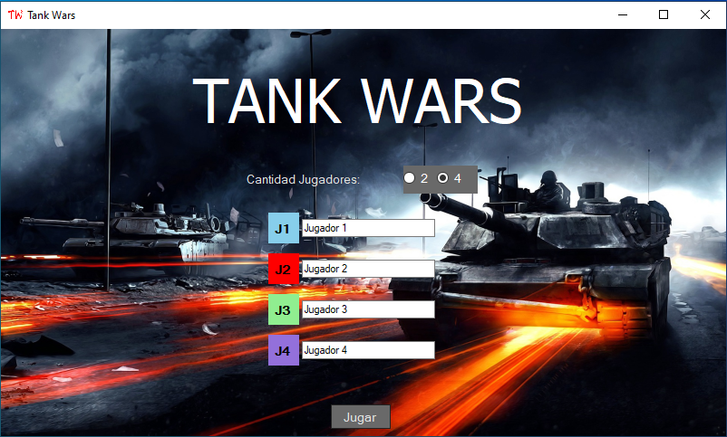

# Tank Wars
Versión de escritorio de mi proyecto de juventud del 2018.

# Descargar
Puedes ir a la sección de [Releases](https://github.com/ElrohirGT/Tank-Wars/releases) para descargar el juego, únicamente se puede jugar en windows.

# ¿Cómo jugar?
1) Descarga y descomprime el .zip, lugeo haz doble click en el .exe que descomprimiste, verás este menú.

2) Puedes seleccionar la cantidad de jugadores que quieres (2 o 4 jugadores) y cambiarle los nombres.
3) Una vez tengas listo puedes presionar jugar y el juego comenzará, puedes ver a un lado del tablero las reglas y cómo funciona el juego, sin embargo te las explico también más abajo.

# Reglas
- El objetivo del juego es eliminar a todos los tanques enemigos, para lograr esto tienes 6 tanques pequeños y un tanque madre.
- Todos los tanques pueden moverse y disparar, sin embargo los tanques madres pueden moverse mucho y tienen más rango que los tanques pequeños.
- Todos los tanques solo pueden moverse y disparar a donde estén apuntando.
- Cuando un tanque pequeño mata a otros 2 tanques puede evolucionar y convertirse en un tanque madre.
- El tanque madre cuando muere se convierte en un tanque pequeño.
- Tienes 3 movimientos por turno, un movimiento puede ser usado en: disparar, mover una pieza, girar una pieza. Si no quieres usar todos tus movimientos puedes saltar turno, sin embargo, necesitas realizar al menos 1 movimiento para poder saltar turno.

**Tablero de 4P**

